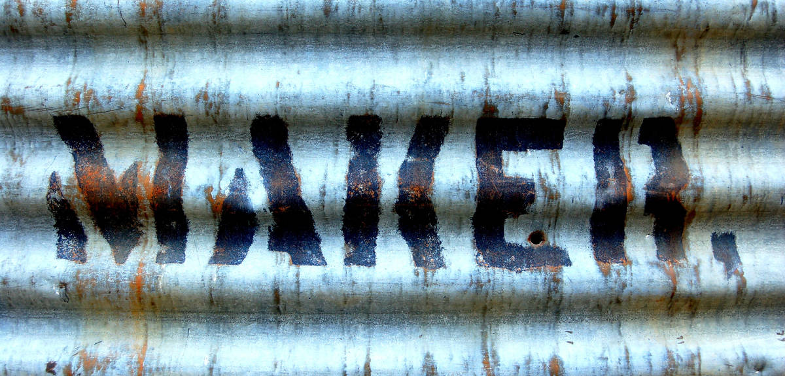

#### #callforactivities #callformakers #callforpapers

Dias 15 e 16 de Dezembro vai decorrer o Encontro de Laboratórios e Makerspaces no LCD Porto.

Este encontro pretende ser um espaço de convívio da comunidade Maker e uma oportunidade de conhecer novos espaços num ecosistema que se começa a estabelecer.

## Iremos ter:

* workshops introdutórios de curta duração, que costumamos referir como Flash Classes,
* palestras
* mostra de projetos, concluídos ou em curso
* mesa redonda "Ecosistema da Comunidade Maker"
* tertulia dedicada ao tema "Futuro do Trabalho"
* muito convivio

## Call for Activities

Procuramos neste momento propostas para:

* workshops
* palestras (talks)
* projetos para a mostra

Podes submeter a tua proposta usando um formulário seguindo os liks acima ou fazendo um Pull Request no [repositório][repo] em que estamos a coordenar a organização.

https://github.com/lcdporto/encontro-labs-e-makerspaces-2018

---

Este artigo irá sendo atualizado com novidades e alterações de curso ;-)

[repo]:https://github.com/lcdporto/encontro-labs-e-makerspaces-2018

---
<a href="https://unsplash.com/photos/P68Dmi7PQlU" target="_blank">Cover photo</a>
by <a href="https://mattartzblog.wordpress.com/" target="_blank">Matt Artz</a>
