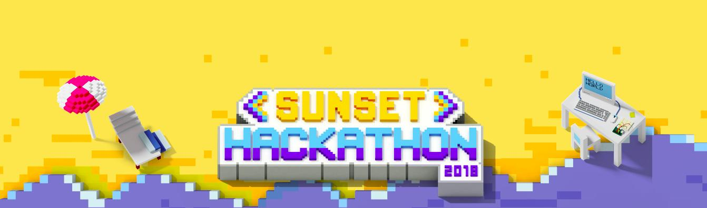

Na LCD Agenda procuramos divulgar eventos no Porto e arredores sobre temáticas que interessam à Comunidade do LCD Porto.

Focamos-nos portanto em Fabricação Digital, Instalações Intercativas e toda a multiplicidade de disciplinas que servem de base como programação, design, eletrónica, microcontroladores, etc., etc..

Vê mais abaixo como podes adicionar ao teu calendário ou sugerir mais eventos.

### Ainda este fim-de-semana

#### Sábado, 1 de Setembro

* [iOS Peer Lab Porto](https://www.meetup.com/iOS-Peer-Lab-Porto/events/qsbtppyxmbcb/)
@ [The Feeting Room - Porto](https://www.thefeetingroom.com/pages/flagship-store)
([mapa](https://goo.gl/maps/HxwkF56HQS72))

### Para a Semana

#### Segunda-feira, 3 de Setembro

* [Android Peer Lab](
https://www.meetup.com/Android-Peer-Lab/events/254151567/)
@ [Porto i/o](http://porto.io/) Downtown
([mapa](https://maps.google.com/?cid=12457545381001472324))

#### Quarta-feira, 5 de Setembro

* [GDG - Android Sessions - #4](https://www.meetup.com/GDG-Porto/events/253780128)
@ [Farfetch](https://www.farfetch.com/pt/careers#10003)
([mapa](https://goo.gl/maps/sVqrgbSqpsH2))

#### Quinta-feira, 6 de Setembro

* [UX and Emotions](https://www.meetup.com/PortoUX/events/254167823/)
@[Founders Founders](http://www.founders-founders.com/)
([mapa](https://maps.google.com/?cid=3857852217621409279))

#### Sexta-feira, 7 de Setembro

* **[Sunset Hackathon 2018](https://sunsethackathon.com/)**
---
@ Cais Criatico, Costa Nova, Ilhavo ([mapa](https://www.google.pt/maps/place/Cais+Criativo+da+Costa+Nova/@40.6122189,-8.7518707,15z/data=!4m5!3m4!1s0x0:0x4d8ecac6c6fb5862!8m2!3d40.6122189!4d-8.7518707))

O Sunset Hackathon é uma maratona tecnológica de 72 horas focada na criação de soluções inovadoras para problemas propostos e que reúne talentos, startups e empresas, num contexto descontraído e de Verão.

* [Workshop Fotografia Noturna no Parque](https://www.serralves.pt/pt/actividades/workshops-de-fotografia-noturna-no-parque-ha-luz-no-parque-2018/)
@ [Parque de Serralves](https://www.serralves.pt/pt/)
([mapa](https://goo.gl/maps/zpUmKAB8Dhv))

---

## Falta aqui o teu evento?

Podes suregir algo que nos tenha escapado usa este [Google Form](https://docs.google.com/forms/d/e/1FAIpQLSd_lOqzaRXBpCmAbJ9ODMuWPgkLzaN4xABgRX6HXPpDSDUB7Q/viewform?usp=sf_link).

## Como podes adicionar ao teu calendário

Podes adicionar a LCD Agenda ao calendário que habitualmente usas, quase todos têm essa opção. Vê as instruções seguindo os links.

* [Google Calendar](https://support.google.com/calendar/answer/37100?co=GENIE.Platform%3DDesktop&hl=en)
* [Microsoft Outlook](https://support.office.com/en-us/article/Import-or-subscribe-to-a-calendar-in-Outlook-com-cff1429c-5af6-41ec-a5b4-74f2c278e98c)

O link que tens que usar é este:

https://calendar.google.com/calendar/ical/jfig.net_0gpa7saiiduptpqg4fc3sq1f7c%40group.calendar.google.com/public/basic.ics
