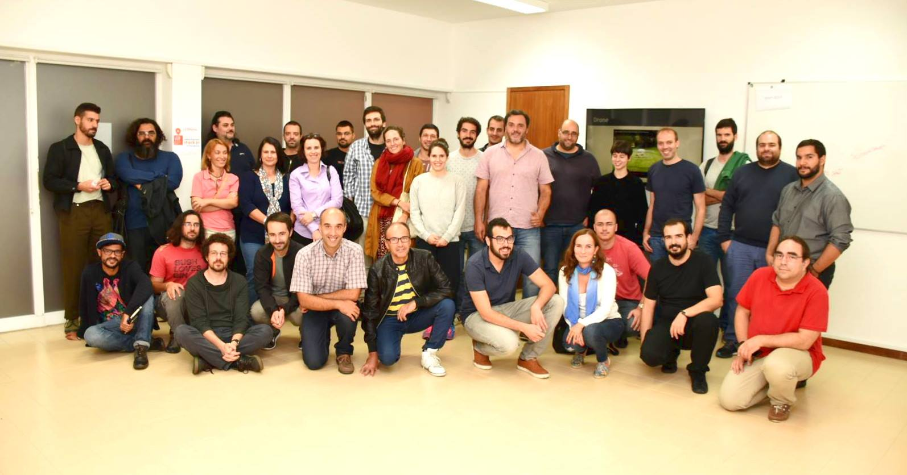

Na LCD Agenda procuramos divulgar eventos no Porto e arredores sobre temáticas que interessam à Comunidade do LCD Porto.

Focamos-nos portanto em Fabricação Digital, Instalações Intercativas e toda a multiplicidade de disciplinas que servem de base como programação, design, eletrónica, microcontroladores, etc., etc..

Vê mais abaixo como podes adicionar ao teu calendário ou sugerir mais eventos.

### Ainda este fim-de-semana

#### Sábado

* [Productivity & Speaking Gigs by Portuguese Women in Tech](https://www.eventbrite.co.uk/e/productivity-speaking-gigs-tickets-50037126392)
@ [Selina](https://www.selina.com/) Porto
([mapa](https://goo.gl/maps/wUKPojFDL5F2))

### Para a semana

#### Segunda-feira, 1 de Outubro

* [Porto Big Data](https://www.meetup.com/Porto-Big-Data/events/254882622/)
@ [Farfetch](https://www.farfetch.com/pt/careers#10003)
([mapa](https://goo.gl/maps/sVqrgbSqpsH2))

#### Terça-feira. 2 de Outubro

* **[Abertura Atividades 2018/2019](https://www.facebook.com/events/1810807799040117/)**
@ [LCD Porto](https://lcdporto.org/)
([mapa](https://goo.gl/maps/A65zj4ZXTrp))

  Vamos apresentar as atividades planeadas até ao final do ano. Vamos ter workshops, palestras, tertulias e uma poll de projetos para participar.

#### Sábado, 6 de Outubro

* [DSPT Day - DataScience Portugal](https://dsptday.com/)
@ FEUP ([mapa](https://goo.gl/maps/j8oKnpDZQ412))

* [PyCoffee. Hot coffee and Pythonic discussions](https://www.meetup.com/pyporto/events/252098689/)
@ [Porto i/o](http://porto.io/) Downtown
([mapa](https://maps.google.com/?cid=12457545381001472324))

---

## Falta aqui o teu evento?

Podes suregir algo que nos tenha escapado usa este [Google Form](https://docs.google.com/forms/d/e/1FAIpQLSd_lOqzaRXBpCmAbJ9ODMuWPgkLzaN4xABgRX6HXPpDSDUB7Q/viewform?usp=sf_link).

## Como podes adicionar ao teu calendário

Podes adicionar a LCD Agenda ao calendário que habitualmente usas, quase todos têm essa opção. Vê as instruções seguindo os links.

* [Google Calendar](https://support.google.com/calendar/answer/37100?co=GENIE.Platform%3DDesktop&hl=en)
* [Microsoft Outlook](https://support.office.com/en-us/article/Import-or-subscribe-to-a-calendar-in-Outlook-com-cff1429c-5af6-41ec-a5b4-74f2c278e98c)

O link que tens que usar é este:

https://calendar.google.com/calendar/ical/jfig.net_0gpa7saiiduptpqg4fc3sq1f7c%40group.calendar.google.com/public/basic.ics
