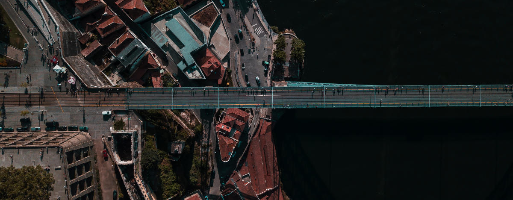

Na LCD Agenda procuramos divulgar eventos no Porto e arredores sobre temáticas que interessam à Comunidade do LCD Porto.

Focamos-nos portanto em Fabricação Digital, Instalações Intercativas e toda a multiplicidade de disciplinas que servem de base como programação, design, eletrónica, microcontroladores, etc., etc..

Vê mais abaixo como podes adicionar ao teu calendário ou sugerir mais eventos.

### Ainda este fim-de-semana

#### Sexta dia 5 a Domingo dia 7

* [VIANA BRInCKa 2018 LEGO Fan Event](http://www.cm-viana-castelo.pt/pt/agenda-cultural/viana-brincka-2018-lego-fan-event)
@  Centro Cultural de Viana do Castelo ([mapa](https://goo.gl/maps/TqMi4XrXpjQ2))

#### Sábado, 6 de Outubro

* [DSPT Day - DataScience Portugal](https://dsptday.com/)
@ FEUP ([mapa](https://goo.gl/maps/j8oKnpDZQ412))

#### Domingo, 7 de Outubro

* [PyCoffee. Hot coffee and Pythonic discussions](https://www.meetup.com/pyporto/events/252098689/)
@ [Porto i/o](http://porto.io/) Downtown
([mapa](https://maps.google.com/?cid=12457545381001472324))

### Para a semana

#### Terça-feira, 9 de Outubro

* **[LCD Porto - Laboratório Aberto](https://www.lcdporto.org/atividades/laboratorio-aberto)**
@ [LCD Porto](https://lcdporto.org/)
([mapa](https://goo.gl/maps/A65zj4ZXTrp))
* [Porto Testers Meetup](https://www.eventbrite.pt/e/bilhetes-porto-testers-meetup-31-50907010238)
@ [BySide](http://www.byside.com/)
([mapa(https://goo.gl/maps/QefrYbyNXYw)])

#### Quarta-feira, dia 10 de Outubro

* [Working Ideas Sessão de Abertura com Farfetch](https://www.eventbrite.pt/e/registo-working-ideas-sessao-de-abertura-com-farfetch-50823866553)
@ Universidade do Minho, Campos de Gualtar
([mapa](https://goo.gl/maps/JMypYYYpBHo))

* [Distributed Systems [Nerdzao PT]](https://www.meetup.com/Nerdzao-PT/events/255246826/)
@ [Farfetch](https://www.farfetch.com/pt/careers#10003)
([mapa](https://goo.gl/maps/sVqrgbSqpsH2))

* [CocoaHeads Porto](https://www.meetup.com/CocoaHeads-Porto/events/255260956/)
@ [Polo Zero](http://polozero.fap.pt/)
([mapa](https://maps.google.com/?cid=6452894895241246126))

#### Quinta-feira, dia 11 de Outubro

* **[Techdays](http://www.techdays.pt/)** (de Quinta a Sábado)
@ [Aveiro Expo](http://aveiroexpo.com/)
([mapa](https://goo.gl/maps/oa4Pbksvj3t))
* [Cidades Inteligentes [TechDays]](https://www.facebook.com/events/332531197314701/)
@ [Aveiro Expo](http://aveiroexpo.com/)
([mapa](https://goo.gl/maps/oa4Pbksvj3t))
* [Industria 4.0 [Techdays]](https://www.facebook.com/events/333735387200169/)
@ [Aveiro Expo](http://aveiroexpo.com/)
([mapa](https://goo.gl/maps/oa4Pbksvj3t))
* [Neurociência e Aprendizagem](https://www.facebook.com/events/175531836674359/)
@ Scholé / Matosinhos
([mapa](https://goo.gl/maps/PT8XB4zBLjQ2))
* [Statistics & AI in the Real World](https://www.meetup.com/datascienceportugal/events/254550968/)
@ [Bosh Chassis Systems](https://www.bosch.pt/) / Braga
([mapa](https://goo.gl/maps/m4GrKzHjwyL2))
* [Failure Thursdays by Porto i/o](https://www.meetup.com/Porto-i-o-events/events/254714354/)
@ [Porto i/o](http://porto.io/) Riverside
([mapa](https://goo.gl/maps/AZdcydFrGqC2))
* [OPO.design #2 - Porto Design Community](https://www.meetup.com/opodesign/events/254846733/)
@ [Polo Zero](http://polozero.fap.pt/)
([mapa](https://maps.google.com/?cid=6452894895241246126))
* [Porto Codes](https://www.meetup.com/portocodes/events/252098698/)
@ [Porto i/o](http://porto.io/) Santa Catarina
([mapa](https://goo.gl/maps/psfyAW9T3nF2))

#### Sexta-feira, 12 de Outubro

* [Economia Circular [Techdays]](https://www.facebook.com/events/679298482446068/)
@ [Aveiro Expo](http://aveiroexpo.com/)
([mapa](https://goo.gl/maps/oa4Pbksvj3t))
* [Talentos e Competências [TechDays]](https://www.facebook.com/events/644294392637950/)
@ [Aveiro Expo](http://aveiroexpo.com/)
([mapa](https://goo.gl/maps/oa4Pbksvj3t))
* [Mobilidade [Techdays]](https://www.facebook.com/events/1929888713758357/)
@ [Aveiro Expo](http://aveiroexpo.com/)
([mapa](https://goo.gl/maps/oa4Pbksvj3t))
* [Data Science [Techdays] [DSPT]](Description:http://www.techdays.pt/pt/techdays)
@ [Aveiro Expo](http://aveiroexpo.com/)
([mapa](https://goo.gl/maps/oa4Pbksvj3t))

#### Sábado, 13 de Outubro
* **[METROLAB AMP - Hackaton e Prototipagem](https://metrolab.amp.pt/evento/concurso-hackaton-prototipagem/)**
@ Palácio dos Correios
([mapa](https://goo.gl/maps/Uvr8FwJCjvR2))
* [gRPC - Reunião da NetPonto no Porto](https://www.eventbrite.co.uk/e/23a-reuniao-da-netponto-no-porto-tickets-50915579870)
@ [REACTOR Innovation Hub](https://reactorhub.io/)
([mapa](https://goo.gl/maps/jHDyounA2Ds))
* [iOS Peer Lab Porto](https://www.meetup.com/iOS-Peer-Lab-Porto/events/krvrdqyxnbrb/)
@ TBA
* [Meetup Made in Aveiro [Techdays]](https://www.facebook.com/events/486095031873318/)
@ [Aveiro Expo](http://aveiroexpo.com/)
([mapa](https://goo.gl/maps/oa4Pbksvj3t))
* [Workshop de Serigrafia Têxtil](https://www.facebook.com/events/671771003191654/)
@ [CRU loja / Cowork](http://cru-cowork.com/)
([mapa](https://goo.gl/maps/tpq96ddZ6JA2))
* [The Future of Work and the Creative Freelancing in the New Economy](https://www.meetup.com/solosessionsporto/events/254997405/)
@ [CRU loja / Cowork](http://cru-cowork.com/)
([mapa](https://goo.gl/maps/tpq96ddZ6JA2))

---

## Falta aqui o teu evento?

Podes suregir algo que nos tenha escapado usa este [Google Form](https://docs.google.com/forms/d/e/1FAIpQLSd_lOqzaRXBpCmAbJ9ODMuWPgkLzaN4xABgRX6HXPpDSDUB7Q/viewform?usp=sf_link).

## Como podes adicionar ao teu calendário

Podes adicionar a LCD Agenda ao calendário que habitualmente usas, quase todos têm essa opção. Vê as instruções seguindo os links.

* [Google Calendar](https://support.google.com/calendar/answer/37100?co=GENIE.Platform%3DDesktop&hl=en)
* [Microsoft Outlook](https://support.office.com/en-us/article/Import-or-subscribe-to-a-calendar-in-Outlook-com-cff1429c-5af6-41ec-a5b4-74f2c278e98c)

O link que tens que usar é este:

https://calendar.google.com/calendar/ical/jfig.net_0gpa7saiiduptpqg4fc3sq1f7c%40group.calendar.google.com/public/basic.ics
