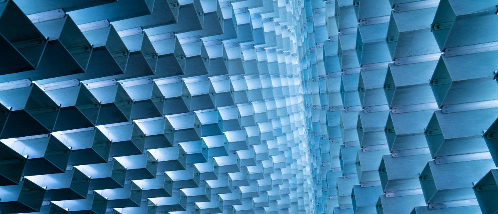

Na LCD Agenda procuramos divulgar eventos no Porto e arredores sobre temáticas que interessam à Comunidade do LCD Porto.

Focamos-nos portanto em Fabricação Digital, Instalações Intercativas e toda a multiplicidade de disciplinas que servem de base como programação, design, eletrónica, microcontroladores, etc., etc..

Vê mais abaixo como podes adicionar ao teu calendário ou sugerir mais eventos.

### Ainda este fim-de-semana

#### Sábado
* **[METROLAB AMP - Hackaton e Prototipagem](https://metrolab.amp.pt/evento/concurso-hackaton-prototipagem/)**
@ Palácio dos Correios
([mapa](https://goo.gl/maps/Uvr8FwJCjvR2))
* [gRPC - Reunião da NetPonto no Porto](https://www.eventbrite.co.uk/e/23a-reuniao-da-netponto-no-porto-tickets-50915579870)
@ [REACTOR Innovation Hub](https://reactorhub.io/)
([mapa](https://goo.gl/maps/jHDyounA2Ds))
* [iOS Peer Lab Porto](https://www.meetup.com/iOS-Peer-Lab-Porto/events/krvrdqyxnbrb/)
@ TBA
* [Meetup Made in Aveiro [Techdays]](https://www.facebook.com/events/486095031873318/)
@ [Aveiro Expo](http://aveiroexpo.com/)
([mapa](https://goo.gl/maps/oa4Pbksvj3t))
* [Workshop de Serigrafia Têxtil](https://www.facebook.com/events/671771003191654/)
@ [CRU loja / Cowork](http://cru-cowork.com/)
([mapa](https://goo.gl/maps/tpq96ddZ6JA2))
* [The Future of Work and the Creative Freelancing in the New Economy](https://www.meetup.com/solosessionsporto/events/254997405/)
@ [CRU loja / Cowork](http://cru-cowork.com/)
([mapa](https://goo.gl/maps/tpq96ddZ6JA2))

### Para a semana

#### Segunda-feira, 15 de Outubro

* [Coworking, Coliving and Workations: new breakouts for the independent workforce]
(https://www.meetup.com/solosessionsporto/events/254998417/)
@ [CRU loja / Cowork](http://cru-cowork.com/)
([mapa](https://goo.gl/maps/tpq96ddZ6JA2))

* [European Freelancers Week | Porto Meetup]
(https://www.meetup.com/Porto-i-o-events/events/255361730/)
@ [Porto i/o](http://porto.io/) Santa Catarina
([mapa](https://goo.gl/maps/psfyAW9T3nF2))

#### Terça-feira, 16 de Outubro

* **[LCD Porto - Laboratório Aberto]
(https://www.lcdporto.org/atividades/laboratorio-aberto)**
@ [LCD Porto](https://lcdporto.org/)
([mapa](https://goo.gl/maps/A65zj4ZXTrp))

* [Braga.Design.JS]
(https://www.meetup.com/bragadesign/events/255085502/)
@ [gnration](http://www.gnration.pt/) / Braga
([mapa](https://goo.gl/maps/FoRAom2wzhF2))

* [DevOps Porto #21: Say hello to SDN]
(https://www.meetup.com/devopsporto/events/255390972/)
@ [Porto i/o](http://porto.io/) Santa Catarina
([mapa](https://goo.gl/maps/psfyAW9T3nF2))

* [CocoaHeads Porto]
(https://www.meetup.com/CocoaHeads-Porto/events/255419806/)
@ [Polo Zero](http://polozero.fap.pt/)
([mapa](https://maps.google.com/?cid=6452894895241246126))

#### Quarta-feira, 17 de Outubro

* [Let's Grow Again #19]
(https://www.eventbrite.co.uk/e/lets-grow-again-19-tickets-50063072999)
@ [Founders Founders](http://www.founders-founders.com/)
([mapa](https://maps.google.com/?cid=3857852217621409279))

* [PWIT Awards Gathering : Outsystems]
(https://www.eventbrite.co.uk/e/pwit-awards-gathering-outsystems-tickets-50926727212)
@ [Outsystems](https://www.outsystems.com/) / Braga
([mapa](https://goo.gl/maps/g3UBnjgffA52))

* [Porto Digital Nomads]
(https://www.meetup.com/Porto-Digital-Nomads-Meetup/events/dxpnwpyxnbwb/)
@ [Porto i/o](http://porto.io/) Riverside
([mapa](https://goo.gl/maps/AZdcydFrGqC2))

#### Quinta-feira, 18 de Outubro

* [G2PT70 - 70º Geek Girls Portugal - Aveiro]
(https://www.eventbrite.pt/e/bilhetes-g2pt70-70o-geek-girls-portugal-aveiro-51156454332)
@ Vulcano - Bosch Thermotechnology - Cacia, Aveiro
([mapa](https://goo.gl/maps/Ft5ZmPG92q52))

#### Sábado, 20 de Outubro

* [Workshop Design Thinking - Critical Manufacturing (Porto)]
(https://www.eventbrite.pt/e/bilhetes-workshop-design-thinking-critical-manufacturing-porto-51138084387)
@ [Critical Manufacturing](http://www.criticalmanufacturing.com/) / Maia
([mapa](https://goo.gl/maps/6dPeYTQeR7m))

* [PyCoffee. Hot coffee and Pythonic discussions]
(https://www.meetup.com/pyporto/events/252098706/)
@ [Porto i/o](http://porto.io/) Downtown
([mapa](https://maps.google.com/?cid=12457545381001472324))

---

## Falta aqui o teu evento?

Podes sugerir algo que nos tenha escapado usa este [Google Form](https://docs.google.com/forms/d/e/1FAIpQLSd_lOqzaRXBpCmAbJ9ODMuWPgkLzaN4xABgRX6HXPpDSDUB7Q/viewform?usp=sf_link).

## Como podes adicionar ao teu calendário

Podes adicionar a LCD Agenda ao calendário que habitualmente usas, quase todos têm essa opção. Vê as instruções seguindo os links.

* [Google Calendar](https://support.google.com/calendar/answer/37100?co=GENIE.Platform%3DDesktop&hl=en)
* [Microsoft Outlook](https://support.office.com/en-us/article/Import-or-subscribe-to-a-calendar-in-Outlook-com-cff1429c-5af6-41ec-a5b4-74f2c278e98c)

O link que tens que usar é este:
<small>
https://calendar.google.com/calendar/ical/jfig.net_0gpa7saiiduptpqg4fc3sq1f7c%40group.calendar.google.com/public/basic.ics
</small>

---
<a href="https://unsplash.com/photos/JHVLDegi89s" target="_blank">Cover photo</a>
by <a href="https://unsplash.com/@joshyangg" target="_blank">Josh Yang</a>
