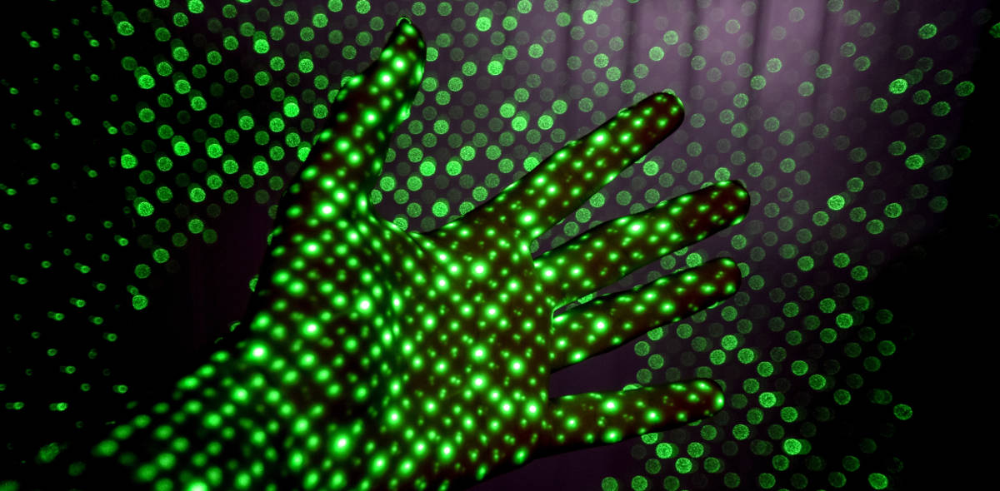

Semana de "ponte", semana de poucos eventos.

Na LCD Agenda procuramos divulgar eventos no Porto e arredores sobre temáticas que interessam à Comunidade do LCD Porto.

Focamos-nos portanto em Fabricação Digital, Instalações Intercativas e toda a multiplicidade de disciplinas que servem de base como programação, design, eletrónica, microcontroladores, etc., etc..

Vê mais abaixo como podes adicionar ao teu calendário ou sugerir mais eventos.

### Ainda este fim-de-semana

#### Sábado

* **[Portuguese Women in Tech Awards Ceremony]
(https://www.eventbrite.co.uk/e/portuguese-women-in-tech-awards-tickets-51102671466)**
@ Alfândega do Porto
([mapa](https://goo.gl/maps/7xLNT51n3cz))
 <small>Atribuição dos primeiros prémios Portuguese Women in Tech Awards, Founders / Co-Founder, Marketing & Sales Expert and Developer </small>

* **[TEDxGuimarães]
(https://tedxguimaraes.com/homepage-2018/)**
@ [Centro Internacional das Artes José de Guimarães](http://www.ciajg.pt/) / Guimarães
([mapa](https://goo.gl/maps/BVS79UPCiHu))

* [iOS Peer Lab Porto]
(https://www.meetup.com/iOS-Peer-Lab-Porto/events/krvrdqyxnbkc/)
@ Mercado Bom Sucesso
([mapa](https://goo.gl/maps/yxhdBVQ38m32))

* [V. Vuksic / Blason / Lonz Dale's Fantasy / G. Cohen / O Bergado]
(https://www.facebook.com/events/2008613902506944/)
@ [We Came From Space](http://wecamefromspace.com/)
([mapa](https://goo.gl/maps/KFwZu7p6xCq)) 
  <small>Concertos, exposição, workshop, jantar e bebidas</small>

#### Domingo

* [Computer Jam Workshop by Valentina Vuksic]
(https://www.facebook.com/events/253873308650570/)
@ [We Came From Space](http://wecamefromspace.com/)
([mapa](https://goo.gl/maps/KFwZu7p6xCq))

### Para a Semana

#### Segunda-feira, 29 de Outugro

* **[Hacktoberfest @ Porto]
(https://www.eventbrite.com/e/hacktoberfest-porto-tickets-51409133101)**
@ [Talkdesk](https://www.talkdesk.com/)
([mapa](https://goo.gl/maps/7evdpYhQWS52))
 <small>Hacktoberfest is all about encouraging meaningful contributions to the open source ecosystem.</small>

* **Segungda 29 a Quinta 1 Nov** [Semana de Informática]
(https://www.eventbrite.com/e/semana-de-informatica-tickets-50695985056)
@ FEUP
([mapa](https://goo.gl/maps/j8oKnpDZQ412))

#### Terça-feira, 30 de Outubro

* **[LCD Porto - Laboratório Aberto]
(https://www.lcdporto.org/atividades/laboratorio-aberto)**
@ [LCD Porto](https://lcdporto.org/)
([mapa](https://goo.gl/maps/A65zj4ZXTrp))

* [Harvest, Yield, and Scalable Tolerant Systems]
(https://www.meetup.com/Papers-We-Love-Porto/events/255632610/)
@ [Porto i/o](http://porto.io/) Santa Catarina
([mapa](https://goo.gl/maps/psfyAW9T3nF2))
 <small>Papers We Love - presentation around the CAP Theorem and its misconceptions</small>

#### Quarta-feira, 31 de Outubro

* [[0x6F] - The Meet - 0xOPOSE]
(https://www.meetup.com/0xOPOSEC/events/255388262/)
@ [Blip](https://www.blip.pt/)
([mapa](https://maps.google.com/?cid=12241631696413520772))

#### Sábado, 3 de Novembro

* [CoderDojo Vila do Conde]
(https://www.facebook.com/events/2123565031227988/)
@ [BindTuning](https://bindtuning.com/) / Vila do Conde
([mapa](https://goo.gl/maps/Wyxbbj969Ry))
 <small>evento gratuito onde, de forma simples, jovens dos 7 aos 17 anos tem contacto com tecnologia e programação</small>

#### Domingo, 4 de Novembro

* [PyCoffee. Hot coffee and Pythonic discussions]
(https://www.meetup.com/pyporto/events/dzkzhqyxpbgb/)
@ [Porto i/o](http://porto.io/) Downtown
([mapa](https://maps.google.com/?cid=12457545381001472324))

## Atividades do LCD Porto

Verificar sempre, seguindo os links, se o evento requer incrição.

#### Novembro

* **dia 2** - Visita à Escola da Ponte
* **dia 10** - [Workshop de Introdução ao Arduino](https://lcdporto.org/atividades/workshop-introducao-ao-arduino) 
  <small>podes saber mais sobre o Arduino no [post sobre o Workshop de Iniciação ao Arduino](../workshop-arduino-20181110/)</small>
* **dia 17** - Tertúlia LCD - Influência da Tecnologia

#### Dezembro
* **dia 4** - [LCD Meetup: O Design de Produto, Design Industrial - Tauan Tacchini Bernardo ](https://www.meetup.com/LCD-Meetups/events/255361100/)
* **dia 8** - [Workshop Corte a Laser](https://lcdporto.org/atividades/workshop-de-corte-a-laser-1)
* **dias 15 e 16** - Encontro de Laboratórios e Makerspaces
  * 15 - Tertúlia LCD - Futuro do Trabalho

---

## Falta aqui o teu evento?

Podes sugerir algo que nos tenha escapado usa este [Google Form](https://docs.google.com/forms/d/e/1FAIpQLSd_lOqzaRXBpCmAbJ9ODMuWPgkLzaN4xABgRX6HXPpDSDUB7Q/viewform?usp=sf_link).

## Como podes adicionar ao teu calendário

Podes adicionar a LCD Agenda ao calendário que habitualmente usas, quase todos têm essa opção. Vê as instruções seguindo os links.

* [Google Calendar](https://support.google.com/calendar/answer/37100?co=GENIE.Platform%3DDesktop&hl=en)
* [Microsoft Outlook](https://support.office.com/en-us/article/Import-or-subscribe-to-a-calendar-in-Outlook-com-cff1429c-5af6-41ec-a5b4-74f2c278e98c)

O link que tens que usar é este:

https://calendar.google.com/calendar/ical/jfig.net_0gpa7saiiduptpqg4fc3sq1f7c%40group.calendar.google.com/public/basic.ics

---
<a href="https://unsplash.com/photos/flRN6KYpl1A" target="_blank">Cover photo</a>
by <a href="https://unsplash.com/@joshriemer" target="_blank">Josh Riemer</a>
