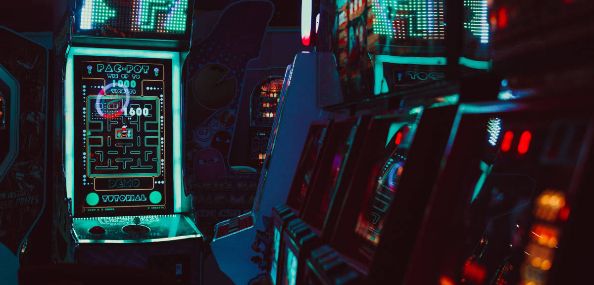

 

Na LCD Agenda procuramos divulgar eventos no Porto e arredores sobre temáticas que interessam à Comunidade do LCD Porto.

Focamos-nos portanto em Fabricação Digital, Instalações Intercativas e toda a multiplicidade de disciplinas que servem de base como programação, design, eletrónica, microcontroladores, etc., etc..

Vê mais abaixo como podes adicionar ao teu calendário ou sugerir mais eventos.

### Ainda este fim-de-semana

#### Sábado

* **[Retro Jam 2018]**
(https://tinyurl.com/ieeeRetroJam18)
@ FEUP ([mapa](https://goo.gl/maps/j8oKnpDZQ412))
 <small>
Game Jam dedicada ao desenvolvimento de jogos com um art-style retro. Desta vez, poderás desenvolver na plataforma que quiseres, mas não te esqueças que tens de continuar a seguir o art-style retro bem como o tema que daremos, por isso terás direito a uma licença Pico-8 caso o desejes!
</small>

* [DevFest 2018 - Coimbra]
(https://devfest.gdgcoimbra.xyz/)
@ [Conservatório de Música de Coimbra](https://www.conservatoriomcoimbra.pt)
([mapa](https://goo.gl/maps/rUfbXvTJp3S2))
 <small>
Focusing in mobile, web, design and hardware this conference combines talks by renowned speakers with technological stimulating workshops, providing a hands-on-learning opportunity
</small>

* [iOS Peer Lab Porto]
(https://www.meetup.com/iOS-Peer-Lab-Porto/events/krvrdqyxpbgc/)
@ TBA
 <small>
iOS Developers who are motivated to spend their Saturday mornings coding and socialising - all experience levels welcome! Non-iOS developers are welcome. Different insights are always treasured
</small>

### Para a semana

#### Terça-feira, 27 de Novembro

* **[LCD Porto - Laboratório Aberto]
(https://www.lcdporto.org/atividades/laboratorio-aberto)**
@ [LCD Porto](https://lcdporto.org/)
([mapa](https://goo.gl/maps/A65zj4ZXTrp))

* [Build Automation in a DevOps way!]
(https://www.meetup.com/devopsporto/events/256370094/)
@ [Talkdesk](https://www.talkdesk.com/)
([mapa](https://goo.gl/maps/7evdpYhQWS52))
 <small>
Guilherme Ferreira, will explore the Build as Code concept and will use [Cake](http://cakebuild.net), a build automation solution based on C#.
</small>

#### Quarta-feira, 28 de Novembro

* [DSPT#44 - Look Up! Data is on you Fraudster….and the Sky!]
(https://www.meetup.com/datascienceportugal/events/256369613/)
@ Vulcano - Bosch Thermotechnology - Cacia, Aveiro
([mapa](https://goo.gl/maps/Ft5ZmPG92q52))
 <small>
We will hear this time Joel Carvalhais from Feedzai about how important is to keep humans in the Machine Learning Loop and hear from Domingos da Silva Barbosa from ENGAGE SKA, about the SKA project, an ambitious international project to scan the whole sky.
</small>

* [Python Porto #10. November]
(https://www.meetup.com/pyporto/events/255823342)
@ [Blip](https://www.blip.pt/)
([mapa](https://maps.google.com/?cid=12241631696413520772))
 <small>
Anyone interested in understanding how Word2Vec Recurrent Neural Networks work? What about doing it while teaching your computer to make jokes?
</small>

#### Quinta-feira, 29 de Novembro

* [ProductTank Porto #3 - Nearly Christmas!]
(https://www.meetup.com/ProductTank-Porto/events/256620285/)
@ [Talkdesk](https://www.talkdesk.com/)
([mapa](https://goo.gl/maps/7evdpYhQWS52))
 <small>
Sara Wood - The Role of Product taking a Tech to IPO Product specialist & Early stage start-up advisor, VP of Product at Farfetch. Sara has seen it all in her roles at Flickr, Wikia/Wikipedia, Layer, United Nations, and Harvard, as well as large Fortune500 companies such as Gap Inc global.
</small>

* [Cozinhando o WordPress para um site 'pro']
(https://www.meetup.com/WP-Porto/events/256564131/)
@ [Porto i/o](http://porto.io/) Seaside
([mapa](https://maps.google.com/?cid=5216069477065432958))
 <small>
Haverá doses de PHP, JS, pitadas de C#, tudo temperado com CSS e HTML, sem esquecer umas quantas coisas que se podem acrescentar a gosto.
</small>

#### Sexta-feira, 30 de Novembro

* [Conferência "Inovação Aberta em Portugal"]
(https://www.eventbrite.pt/e/bilhetes-conferencia-inovacao-aberta-em-portugal-52223771707)
@ [ISAG](https://www.isag.pt/isag/si_main)
([mapa](https://goo.gl/maps/SsrAin1XD1D2))

* [Game Dev Meet @Porto]
(https://www.facebook.com/events/998794986975100/)
@ [NECGM](http://necg.fe.up.pt/)
 <small>
Evento mensal de criadores amadores ou profissionais de jogos ou de pessoas interessadas nesta área para conviver, partilhar projetos e discutir ideias.
</small>

#### Sábado, 1 de Dezembro

* **[TEDxMatosinhos 2018]
(https://www.facebook.com/events/276822753165973/)**
@ [Porto Business School](https://www.pbs.up.pt/)
([mapa](https://goo.gl/maps/J3TggFaMrMo))

* [Stoicism Virtue - “Undistressed, fearless and free”]
(https://www.meetup.com/Stoa-Porto/events/256541114/)
@ [Biblioteca Municipal Almeida Garrett](https://bmp.cm-porto.pt/bmag)
([mapa](https://goo.gl/maps/QEPjUGjyDET2))
 <small>
discutiremos o que é o Conceito de Virtude Estóica. Vamos estabelecer os blocos básicos que formam a filosofia estóica de vida. E porque a virtude é o maior objetivo para a vida.
</small>

#### Domingo, 2 de Novembro

* [PyCoffee. Hot coffee and Pythonic discussions]
(https://www.meetup.com/pyporto/events/dzkzhqyxqbdb/)
@ [Porto i/o](http://porto.io/) Downtown
([mapa](https://maps.google.com/?cid=12457545381001472324))

## Atividades do LCD Porto

Verificar sempre, seguindo os links, se o evento requer incrição.

#### Dezembro

* **dia 4** - [LCD Meetup: O Design de Produto, Design Industrial - Tauan Tacchini Bernardo ](https://www.meetup.com/LCD-Meetups/events/255361100/)

* **dia 8** - [Workshop Corte a Laser](https://lcdporto.org/atividades/workshop-de-corte-a-laser-1)

* **dias 15 e 16** - Encontro de Laboratórios e Makerspaces
  * 15 - Tertúlia LCD - Futuro do Trabalho

---

## Falta aqui o teu evento?

Podes sugerir algo que nos tenha escapado usa este [Google Form](https://docs.google.com/forms/d/e/1FAIpQLSd_lOqzaRXBpCmAbJ9ODMuWPgkLzaN4xABgRX6HXPpDSDUB7Q/viewform?usp=sf_link).

## Como podes adicionar ao teu calendário

Podes adicionar a LCD Agenda ao calendário que habitualmente usas, quase todos têm essa opção. Vê as instruções seguindo os links.

* [Google Calendar](https://support.google.com/calendar/answer/37100?co=GENIE.Platform%3DDesktop&hl=en)
* [Microsoft Outlook](https://support.office.com/en-us/article/Import-or-subscribe-to-a-calendar-in-Outlook-com-cff1429c-5af6-41ec-a5b4-74f2c278e98c)

O link que tens que usar é este:
<small>
https://calendar.google.com/calendar/ical/jfig.net_0gpa7saiiduptpqg4fc3sq1f7c%40group.calendar.google.com/public/basic.ics
</small>
