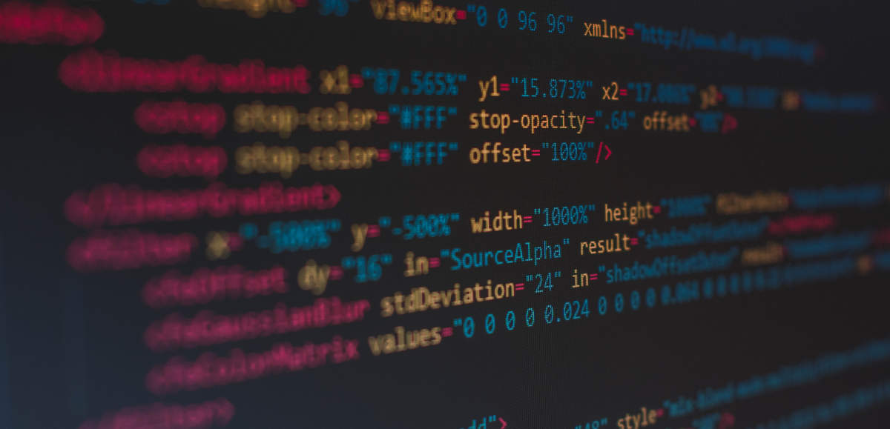

 

Na LCD Agenda procuramos divulgar eventos no Porto e arredores sobre temáticas que interessam à Comunidade do LCD Porto.

Focamos-nos portanto em Fabricação Digital, Instalações Intercativas e toda a multiplicidade de disciplinas que servem de base como programação, design, eletrónica, microcontroladores, etc., etc..

Vê mais abaixo como podes adicionar ao teu calendário ou sugerir mais eventos.

### Ainda este fim-de-semana

#### Sábado

* **[TEDxMatosinhos 2018]
(https://www.facebook.com/events/276822753165973/)**
@ [Porto Business School](https://www.pbs.up.pt/)
([mapa](https://goo.gl/maps/J3TggFaMrMo))

* [Stoicism Virtue - “Undistressed, fearless and free”]
(https://www.meetup.com/Stoa-Porto/events/256541114/)
@ [Biblioteca Municipal Almeida Garrett](https://bmp.cm-porto.pt/bmag)
([mapa](https://goo.gl/maps/QEPjUGjyDET2))
 <small>
discutiremos o que é o Conceito de Virtude Estóica. Vamos estabelecer os blocos básicos que formam a filosofia estóica de vida. E porque a virtude é o maior objetivo para a vida.
</small>

#### Domingo

* [PyCoffee. Hot coffee and Pythonic discussions]
(https://www.meetup.com/pyporto/events/dzkzhqyxqbdb/)
@ [Porto i/o](http://porto.io/) Downtown
([mapa](https://maps.google.com/?cid=12457545381001472324))

### Para a semana

#### Terça-feira, 4 de Dezembro

* **[LCD Meetup: O Design de Produto, Design Industrial - Tauan Tacchini Bernardo ](https://www.meetup.com/LCD-Meetups/events/255361100/)**
@ [LCD Porto](https://lcdporto.org/)
([mapa](https://goo.gl/maps/A65zj4ZXTrp))
 <small>
O design industrial é muito mais que isso, é uma disciplina transversal que procura olhar o produto de dezenas de pontos de vistas diferentes, todos essenciais. Vamos discutir esta abordagem abrangente do design industrial e como ele impacta seu projeto, seja lá qual for ele.
</small>

* [Automotive Testing Solutions Forum 2018 (ATS'2018)]
(https://www.eventbrite.com/e/automotive-testing-solutions-forum-2018-ats2018-registration-49886977292)
@ [AEPortugal](http://www.aeportugal.pt/)
([mapa](https://goo.gl/maps/fDotzraNnMD2))
 <small>
A forum exclusively dedicated to the discussion of testing solutions for the automotive industry, covering recent and foreseen advancements expected in the domain of connected and autonomous driving
</small>

* [DSPT #45 - M.A. & A.M.A. - What??]
(https://www.meetup.com/datascienceportugal/events/256714071/)
@ [Startup Braga](https://www.startupbraga.com/)
([mapa](https://goo.gl/maps/WsVGkvgM4Hy))
 <small>
Marketing Analytics and an Ask Me Anything session
</small>

* [Humane Foodtech: Shopping / Grocery Stores]
(https://www.meetup.com/Humane-Foodtech-Porto/events/256513869/)
@ Bonaparte Baixa
([mapa](https://goo.gl/maps/WePWWYFzPd62))
 <small>
The self-service grocery store is a concept that is only about 100 years old. What’s next? How does the advent of grocery e-commerce affect how we shop for food?
</small>

#### Quarta-feira, 5 de Dezembro

* [Hostelworld Tech Talks]
(https://www.meetup.com/Hostelworld-Meetup-Porto/events/256471491/)
@ [Selina](https://www.selina.com/) Porto
([mapa](https://goo.gl/maps/wUKPojFDL5F2))

* [Machine Learning Porto # Shot Learning & Active Learning]
(https://www.meetup.com/Machine-Learning-Porto/events/256406897/)
@ [Founders Founders](http://www.founders-founders.com/)
([mapa](https://maps.google.com/?cid=3857852217621409279))
 <small>
We will have the pleasure of having Tiago Freitas and Pedro Costa who will be teaching us about One-Shot Learning using Siamese Networks and how to use Active Learning to help labeling your dataset.
</small>

* [Porto Freelancers Meetup | Christmas Edition]
(https://www.meetup.com/Porto-i-o-events/events/256626627/)
@ [Porto i/o](http://porto.io/) Santa Catarina
([mapa](https://goo.gl/maps/psfyAW9T3nF2))

#### Quinta-feira, 6 de Dezembro

* [ØxＯＰＯＳɆＣ Mɇɇtuᵽ - [0x6G] - The Meet]
(https://www.meetup.com/0xOPOSEC/events/256408917/)
@ [Blip](https://www.blip.pt/)
([mapa](https://maps.google.com/?cid=12241631696413520772))

#### Sexta-feira, 7 de Dezembro

* [OPO.js Meetup]
(https://www.meetup.com/opo-js/events/256434646)
@ [Polo Zero](http://polozero.fap.pt/)
([mapa](https://maps.google.com/?cid=6452894895241246126))
 <small>
Três oradores, três palestras, André Cruz, Founder & CTO na MOXY, André Garzia, Tech Speaker na Mozilla e Alex Potsides, Core JavaScript Developer na Protocol Labs.
</small>

#### Sábado, 8 de Dezembro

* **[Workshop Corte a Laser]
(https://lcdporto.org/atividades/workshop-de-corte-a-laser-1)**
@ [LCD Porto](https://lcdporto.org/)
([mapa](https://goo.gl/maps/A65zj4ZXTrp))
 <small>
O workshop de introdução ao corte a laser serve para transmitir aos participantes os conhecimentos necessários para operar a máquina de corte a laser disponível no laboratório.
</small>

* [Música Adaptativa para Video-Jogos com Valter Abreu : Projeto]
(https://www.facebook.com/events/271074676870024/)
@ [Fab Lab porto](http://fablabporto.com/)
([mapa](https://goo.gl/maps/BVb55nZjUyq))
 <small>
Neste workshop iremos explorar alguns conceitos teóricos no contexto da música interativa nos jogos de computador.
</small>

* [iOS Peer Lab Porto]
(https://www.meetup.com/iOS-Peer-Lab-Porto/events/krvrdqyxqblb/)
@ TBA
 <small>
Come join other developers for a peer-based collaborative learning lab. You've got a question? Maybe someone can provide you with some insight.
</small>

## Atividades do LCD Porto

Verificar sempre, seguindo os links, se o evento requer incrição.

#### Dezembro

* **dia 4** - [LCD Meetup: O Design de Produto, Design Industrial - Tauan Tacchini Bernardo ](https://www.meetup.com/LCD-Meetups/events/255361100/)

* **dia 8** - [Workshop Corte a Laser](https://lcdporto.org/atividades/workshop-de-corte-a-laser-1)

* **dias 15 e 16** - Encontro de Laboratórios e Makerspaces
  * 15 - Tertúlia LCD - Futuro do Trabalho

---

## Falta aqui o teu evento?

Podes sugerir algo que nos tenha escapado usa este [Google Form](https://docs.google.com/forms/d/e/1FAIpQLSd_lOqzaRXBpCmAbJ9ODMuWPgkLzaN4xABgRX6HXPpDSDUB7Q/viewform?usp=sf_link).

## Como podes adicionar ao teu calendário

Podes adicionar a LCD Agenda ao calendário que habitualmente usas, quase todos têm essa opção. Vê as instruções seguindo os links.

* [Google Calendar](https://support.google.com/calendar/answer/37100?co=GENIE.Platform%3DDesktop&hl=en)
* [Microsoft Outlook](https://support.office.com/en-us/article/Import-or-subscribe-to-a-calendar-in-Outlook-com-cff1429c-5af6-41ec-a5b4-74f2c278e98c)

O link que tens que usar é este:
<small>
https://calendar.google.com/calendar/ical/jfig.net_0gpa7saiiduptpqg4fc3sq1f7c%40group.calendar.google.com/public/basic.ics
</small>
