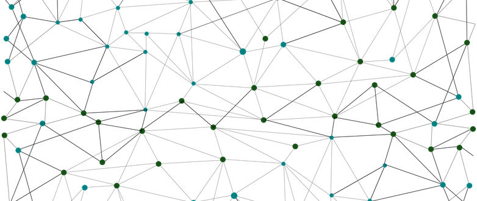

 

Na LCD Agenda procuramos divulgar eventos no Porto e arredores sobre temáticas que interessam à Comunidade do LCD Porto.

Focamos-nos portanto em Fabricação Digital, Instalações Intercativas e toda a multiplicidade de disciplinas que servem de base como programação, design, eletrónica, microcontroladores, etc., etc..

Vê mais abaixo como podes adicionar ao teu calendário ou sugerir mais eventos.

### Ainda este fim-de-Semana

#### Sábado

* [Sandbox Porto | Unconference]
(https://www.eventbrite.pt/e/bilhetes-sandbox-porto-unconference-55352265115)
@ [Porto i/o](http://porto.io/) Santa Catarina
([mapa](https://goo.gl/maps/psfyAW9T3nF2))
 <small>
Together, we’ll the define the topics for the (un)conference and the discussion will flow organically. No stage, no speakers.
</small>

* [Expectativas e desafios do Transhumanismo em Portugal]
(https://www.meetup.com/Transhumanismo-Portugal/events/258471500/)
@ [muarts](https://muarts.tech/)
([mapa](https://goo.gl/maps/aMPj2XJJQYG2))
 <small>
Um dos objetivos deste encontro é o de nos organizar para poder participar de forma ativa na construção de um futuro cheio de inteligência, longevidade e felicidade com abundância para todos!
</small>

* [iOS Peer Lab Porto]
(https://www.meetup.com/iOS-Peer-Lab-Porto/events/krvrdqyzdbvb/)
@ TBA

### Para a semana

#### Terça-feira, 19 de Fevereiro

* **[LCD Porto - Laboratório Aberto]
(https://www.lcdporto.org/atividades/laboratorio-aberto)**
@ [LCD Porto](https://lcdporto.org/)
([mapa](https://goo.gl/maps/A65zj4ZXTrp))
 <small>
**O Laboratório de Criação Digital é um espaço dedicado à criatividade, experimentação e à colaboração multidisciplinar no domínio das artes digitais e multimédia com vista à criação, formação e investigação na intersecção entre a arte, ciência e tecnologia.**
</small>

* [[DevOps] The Trojan Horse for Implementing a DevOps Culture]
(https://www.meetup.com/devopsporto/events/258700942/)
@ [XING Portugal](https://corporate.xing.com/en/)
([mapa](https://goo.gl/maps/ZfQi1Jr3Ecp))
 <small>
“The DevOps way of life” but how we can achieve a perfect synchronization between all of the areas inside a company so that automation becomes a creed and not so much of an imposed rule by the bosses while we keep in mind the UX and UI of it for the people involved, with some practical examples along the way.
</small>

#### Quarta-feira, 20 de Fevereiro

* [[Founders Founders] Let's Grow Again - Fernanda Vasconcelos]
(https://www.eventbrite.co.uk/e/lets-grow-again-23-tickets-55525552422)
@ [Founders Founders](http://www.founders-founders.com/)
([mapa](https://maps.google.com/?cid=3857852217621409279))
 <small>
Fernanda Vasconcelos will be talking about "How do you acquire customers?".
</small>

* [[REACTOR WORKSHOP] Redefining your work culture]
(https://www.eventbrite.com/e/reactor-workshop-redefining-your-work-culture-tickets-56572485828)
@ [REACTOR Innovation Hub](https://reactorhub.io/)
([mapa](https://goo.gl/maps/jHDyounA2Ds))
 <small>
Redefining your work culture: small steps towards big change, with The Human Toolbox
</small>

#### Quinta-feira, 21 de Fevereiro

* [Lessons learned growing a 2-sided marketplace and what's next? with Taxify]
(https://www.meetup.com/VianaTechMeetups/events/257516856/)
@ Blisq / Viana do Castelo
([mapa](https://goo.gl/maps/xXGNv1PMf1L2))
 <small>
Pedro Maia will talk about the 2 marketing strategies, two markets, two fully operations, two totally different approaches from Taxify in Portugal
</small>

* [LEAN COFFEE: Project Management and Agile]
(https://www.eventbrite.com/e/lean-coffee-project-management-and-agile-tickets-55900175931)
@ [REACTOR Innovation Hub](https://reactorhub.io/)
([mapa](https://goo.gl/maps/jHDyounA2Ds))
 <small>
Lean Coffee is a structured, but agenda-less meeting. Participants gather, build an agenda, and begin talking. Conversations are directed and productive because the agenda for the meeting was democratically generated.
</small>

* [[Fullstack Porto] To the infinity & beyond of a scrum team]
(https://www.meetup.com/Fullstack-Porto/events/258923405/)
@ [Talkdesk](https://www.talkdesk.com/)
([mapa](https://goo.gl/maps/7evdpYhQWS52))
 <small>
exploit how can we bring happiness to teams and start to be not productive but hyperproductive. Let’s find out how using scrum patterns, the teams starts to find a way to go to its infinity & beyond!
</small>

* [Failure Thursdays by Porto i/o!]
(https://www.meetup.com/Porto-i-o-events/events/kbxjqqyzdbsb/)
@ [Porto i/o](http://porto.io/) Riverside
([mapa](https://goo.gl/maps/AZdcydFrGqC2))

* [Porto Codes]
(https://www.meetup.com/portocodes/events/rsjhnqyzdbsb/)
@ [Porto i/o](http://porto.io/) Santa Catarina
([mapa](https://goo.gl/maps/psfyAW9T3nF2))
 <small>
overview of the current best practices and caveats to watch out for
</small>

#### Sexta-feira, 22 de Fevereiro

* [Hello Flutter]
(https://www.meetup.com/FlutterPortugal/events/258096347/)
@ [REACTOR Innovation Hub](https://reactorhub.io/)
([mapa](https://goo.gl/maps/jHDyounA2Ds))
 <small>
Flutter is Google's mobile UI framework for crafting high-quality native experiences on iOS and Android in record time. Flutter works with existing code, is used by developers and organizations around the world, and is free and open source.
</small>

#### Sábado, 23 de Fevereiro

* [Inauguração do Makerspace Sandbox Projects]
(https://www.facebook.com/events/539557606530295/)
@ [Núcleo de Arte da Oliva](https://www.olivacreativefactory.com/)
([mapa](https://goo.gl/maps/qezxpWjzL6N2))
 <small>
Uma celebração para comemorar a abertura do Makerspace Sandbox Projects, um local de trabalho que oferece condições a designers, makers e artesãos a criar os seus próprios projectos.
</small>

#### Domingo, 24 de Fevereiro

  * [PyCoffee. Hot coffee and Pythonic discussions in Porto i/o](https://www.meetup.com/pyporto/events/dzkzhqyzdbgc/)

### Na semana seguinte

* **26/2 Terça**

  * **[LCD Porto - Laboratório Aberto](https://www.lcdporto.org/atividades/laboratorio-aberto)**
  * [Aveiro Meetup #22 - Serious Fun](https://www.meetup.com/Agile-Connect-Aveiro/events/258973474/)
  * [Redis Porto #1 - Intro to Redis Commands and Data Structures](https://www.meetup.com/Redis-Porto/events/257403861/)

* **27/2 Quarta**

  * [PWL #09 :: Deep Residual Learning for Image Recognition](https://www.meetup.com/Papers-We-Love-Porto/events/257133828/)

* **28/2 Quinta**

  * [[ØxＯＰＯＳɆＣ Mɇɇtuᵽ] [0x71] - The Meet]( https://www.meetup.com/0xOPOSEC/events/258680115/)
  * [[REACTOR TALK] From What to Why](https://www.facebook.com/events/2085574641664964/)
  * [[Agile Connect] The sunshine, rainbows of working remotely](https://www.meetup.com/Agile-Connect-Porto/events/258871415/)

* **1/3 Sexta**

  * [Python talks with kiwi.com](https://www.meetup.com/pyporto/events/258865271/)

---

## Falta aqui o teu evento?

Podes suregir algo que nos tenha escapado usa este [Google Form](https://docs.google.com/forms/d/e/1FAIpQLSd_lOqzaRXBpCmAbJ9ODMuWPgkLzaN4xABgRX6HXPpDSDUB7Q/viewform?usp=sf_link).

## Como podes adicionar ao teu calendário

Podes adicionar a LCD Agenda ao calendário que habitualmente usas, quase todos têm essa opção. Vê as instruções seguindo os links.

* [Google Calendar](https://support.google.com/calendar/answer/37100?co=GENIE.Platform%3DDesktop&hl=en)
* [Microsoft Outlook](https://support.office.com/en-us/article/Import-or-subscribe-to-a-calendar-in-Outlook-com-cff1429c-5af6-41ec-a5b4-74f2c278e98c)

O link que tens que usar é este:

https://calendar.google.com/calendar/ical/jfig.net_0gpa7saiiduptpqg4fc3sq1f7c%40group.calendar.google.com/public/basic.ics
