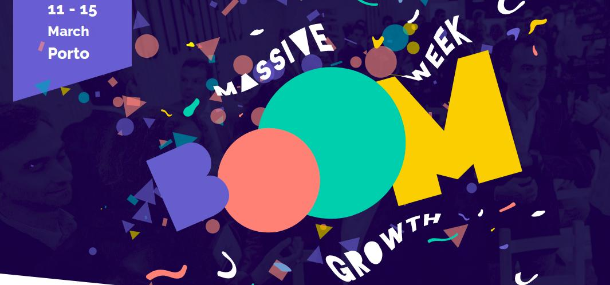

 

Na LCD Agenda procuramos divulgar eventos no Porto e arredores sobre temáticas que interessam à Comunidade do LCD Porto.

Focamos-nos portanto em Fabricação Digital, Instalações Intercativas e toda a multiplicidade de disciplinas que servem de base como programação, design, eletrónica, microcontroladores, etc., etc..

Vê mais abaixo como podes adicionar ao teu calendário ou sugerir mais eventos.

### Ainda este fim-de-Semana

#### Sábado

* [CoderDojo Vila do Conde]
(https://www.eventbrite.com/e/coderdojo-vila-do-conde-43-tickets-57377224824)
@ [BindTuning](https://bindtuning.com/) / Vila do Conde
([mapa](https://goo.gl/maps/Wyxbbj969Ry))
 <small>
O CoderDojo Vila do Conde é um evento gratuito onde, de forma simples, jovens dos 7 aos 17 anos tem contacto com tecnologia e programação.
</small>

* [Workshop sobre Supercollider com Lucas Paris | BMA Lab]
(https://www.facebook.com/events/1906443412742072/)
@ [gnration](http://www.gnration.pt/) / Braga
([mapa](https://goo.gl/maps/FoRAom2wzhF2))
 <small>
Workshop de criação musical em tempo real e ferramentas musicais em SuperCollider com o conceituado artista digital canadiano Lucas Paris.
</small>

### Para a semana

#### Toda a semana 

 

* [Boom week]
(http://www.theboomweek.com/)
Get exclusive tips on marketing & sales

#### Terça-feira, 12 de Março

* **[LCD Porto - Laboratório Aberto]
(https://www.lcdporto.org/atividades/laboratorio-aberto)**
@ [LCD Porto](https://lcdporto.org/)
([mapa](https://goo.gl/maps/A65zj4ZXTrp))
 <small>
**O Laboratório Aberto é um espaço de encontro semanal para o desenvolvimento de projectos e experiências envolvendo tecnologia, ciência e arte. Assenta na livre partilha de informação e conhecimento e na colaboração espontânea entre participantes.**
</small>

#### Quarta-feira, 13 de Março

* [Braga.Growth]
(https://www.meetup.com/Braga-Growth/events/259364403/)
@ [UTRUST](https://utrust.com/)
([mapa](https://goo.gl/maps/5wzLUzPKFWS2))
 <small>
André Santos, CEO and Co-founder at Nutrium. Talking about "Setting up Nutrium Team" // Pedro Costa, Marketing & Growth Director at Nutrium. Talking about "How to develop a Growth Team & processes"
</small>

* [Machine Learning Porto #3 - Explanatory ML]
(https://www.meetup.com/Machine-Learning-Porto/events/259154263/)
@ [Talkdesk](https://www.talkdesk.com/)
([mapa](https://goo.gl/maps/7evdpYhQWS52))
 <small>
Explanatory ML: tell me why, with Kelwin Fernandes
</small>

#### Quinta-feira, 14 de Março

 

* [Mais Perto das Estrelas]
(https://www.facebook.com/events/1964975796956595)
 <small>
Às 21h00 o público é convidado a assistir a uma breve demonstração no interior da cúpula do Planetário digital, onde poderão ver o céu da própria noite. No final da demonstração, se as condições meteorológicas o permitirem, o público deslocar-se-á para o exterior do edifício, onde terá lugar uma observação astronómica com telescópio.
</small>

* [How to Break into Product by Mindera Product Owners]
(https://www.eventbrite.com/e/how-to-break-into-product-by-mindera-product-owners-tickets-57458149873)
@ [Mindera](https://mindera.com/)
([mapa](https://goo.gl/maps/QRzJqBng38S2))

* [DevOps Porto #25: Immutable infrastructure]
(https://www.meetup.com/devopsporto/events/259476255/)
@ Feedzai / Porto
([mapa](https://goo.gl/maps/gS7qMTq1Pey))

* [Porto Codes]
(https://www.meetup.com/portocodes/events/rsjhnqyzfbsb/)
@ [Porto i/o](http://porto.io/) Santa Catarina
([mapa](https://goo.gl/maps/psfyAW9T3nF2))

### Sábado, 16 de Março

* [iOS Peer Lab Porto]
(https://www.meetup.com/iOS-Peer-Lab-Porto/events/krvrdqyzfbvb/)
@TBA

---

## Falta aqui o teu evento?

Podes suregir algo que nos tenha escapado usa este [Google Form](https://docs.google.com/forms/d/e/1FAIpQLSd_lOqzaRXBpCmAbJ9ODMuWPgkLzaN4xABgRX6HXPpDSDUB7Q/viewform?usp=sf_link).

## Como podes adicionar ao teu calendário

Podes adicionar a LCD Agenda ao calendário que habitualmente usas, quase todos têm essa opção. Vê as instruções seguindo os links.

* [Google Calendar](https://support.google.com/calendar/answer/37100?co=GENIE.Platform%3DDesktop&hl=en)
* [Microsoft Outlook](https://support.office.com/en-us/article/Import-or-subscribe-to-a-calendar-in-Outlook-com-cff1429c-5af6-41ec-a5b4-74f2c278e98c)

O link que tens que usar é este:
 <small>
https://calendar.google.com/calendar/ical/jfig.net_0gpa7saiiduptpqg4fc3sq1f7c%40group.calendar.google.com/public/basic.ics
</small
