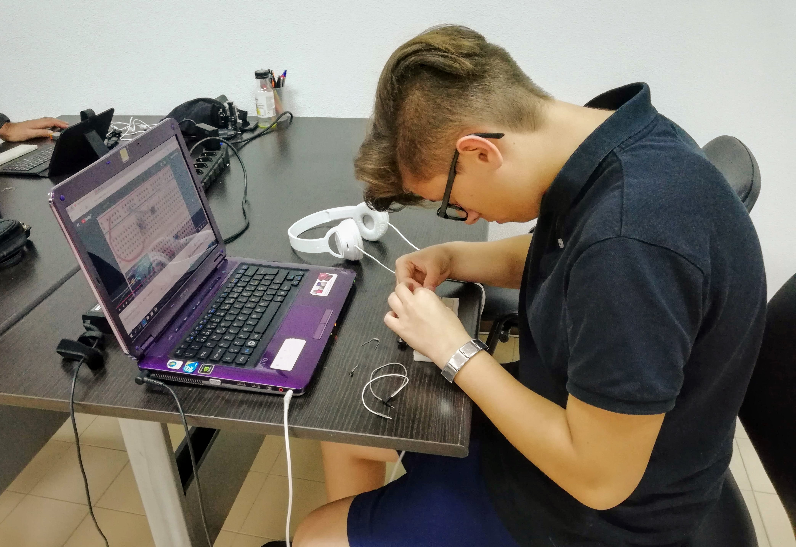
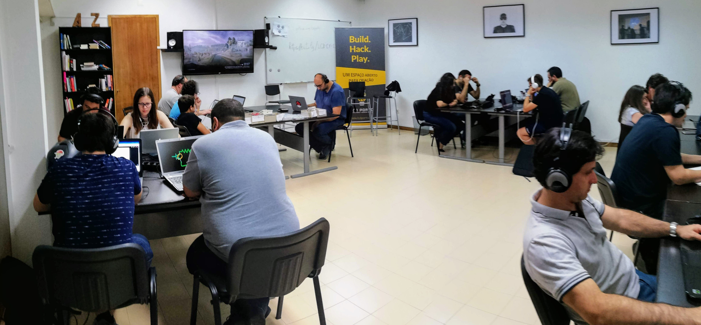

 

Realizamos ontem mais um *Field test* dos [Currículos LCD][c-lcd], 16 participantes, as nossas ‘cobaias’, visualizaram os vídeos das Unidades Um e Dois do Currículo de Eletrónica.

Cada unidade dos Currículos LCD pretende facilitar ao utilizador a aprendizagem que um conjunto do conceitos, para isso são selecionados vídeos do vasto acervo existente online que expliquem o que se pretende transmitir.  

No final da Unidade os utilizadores são desafiados a executar um pequeno projeto para por em prática o que acabaram de aprender.

Estes Field tests têm-nos permitido testar o conceito e afinar as Unidades dos Currículos LCD, melhorando a seleção de vídeos a sua ordem e até a dificuldade dos projetos propostos.

Nas respostas aos inquéritos 100% indicou ter gostado deste método de transmissão de conhecimento e que gostariam de repetir, uma das vantagens indicadas foi o se poder parar o vídeo e voltar a visualizar partes que não tinham percebido bem e poderem controlar o ritmo da ‘aula’.

 

[c-lcd]:https://github.com/lcdporto/curriculos-lcd
