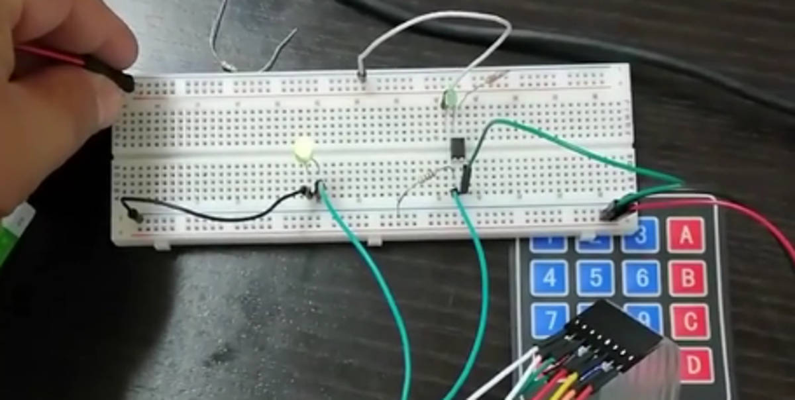

O Projeto do [LCD Monitor](../project-lcd-monitor/) continua em desenvolvimento, o [Gonçalo Pereira][GPreira] fez push da [primeira versão da PCB][pcb] e eu efetuei alguns testes em breadboard para validar o funcionamento dos esquemáticos.

Já comecei também a fazer alguns testes, muito por alto mais provas de conceito, no [código para o Arduino][arduino-code].

Este fim-de-semana conto produzir um circuito em breadborad que simule grande parte do que vai ser a versão em PCB.

[GPreira]:https://github.com/G-Pereira
[repo]:https://github.com/lcdporto/lcd-monitor
[arduino-code]:https://github.com/lcdporto/lcd-monitor/tree/0c6db239b44409c010214d3959ebc1e05a602a92/arduino-code
[pcb]:https://github.com/lcdporto/lcd-monitor/tree/d260d88456c2e35cfab13c3d60c9bae998438b17/pcb
