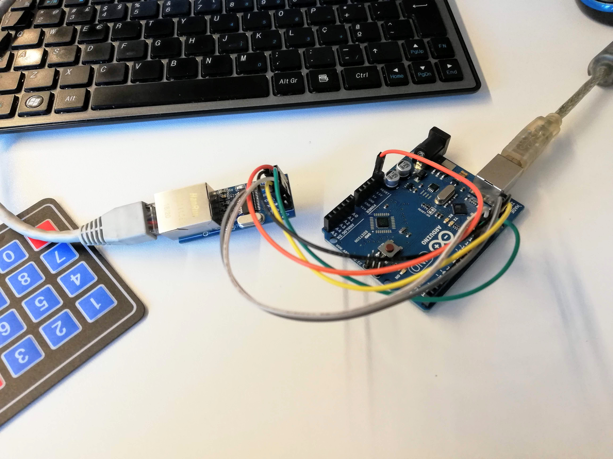

Mais um avanço no projeto [LCD Monitor](../project-lcd-monitor/). O módulo Ethernet foi testado. A principio o sistema ficava pendurado quando o módulo não estava ligado a por ethernet sem qualquer log. Por isso a biblioteca do módulo Ethernet foi alterada para tornar o tempo limite de conecção configurável na inicialização da comunicação. De forma a partilhar esta alteração, foi feito um [_pull request_](pull_request) no repositório da biblioteca.

Envolvidos:

[Gonçalo Pereira](GPereira)

[João Figueiredo](jfig)

[pull_request]:https://github.com/njh/EtherCard/pull/361
[GPreira]:https://github.com/G-Pereira
[jfig]:https://github.com/jfig