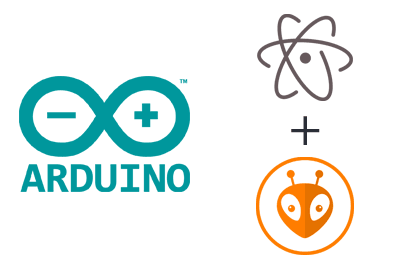

Esta semana no projeto [LCD Monitor](../project-lcd-monitor/) foi substituido o Arduino IDE, a ferramenta de desenvolvimento, pelo [PlatformIO][platformio].

Esta ferramenta é um conjunto de sub ferramentas que fazem do [PlatformIO][platformio] uma ferramenta completa para desenvolvimento de projetos com microcontroladores.

A principal razão para esta mudança é a compatibilidade e flexibilidade com diferentes frameworks e bibliotecas. Com o [PlatformIO][platformio] é possível definir uma lista de dependências do projeto (bibliotecas utilizadas) assim como facilita a escabilidade visto que mudar de microcontrolador torna-se mais simples.
Para além disso as mensagens do compilador são mais verbosas, expondo os _warnings_ gerados de forma a melhorar o código, e é possivel desenhar estratégias de teste do código em ambiente de simulação.

Envolvidos:

[Gonçalo Pereira][GPereira]

[João Figueiredo][jfig]

[platformio]:https://platformio.org/
[GPereira]:https://github.com/G-Pereira
[jfig]:https://github.com/jfig