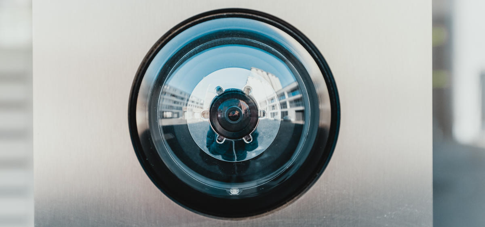

Como espaço de trabalho partilhado por várias pessoas, onde ser pretende ter a maior flexibilidade e ao mesmo tempo segurança e responsabilidade, o controlo de acessos é um desafio que há muito tentamos resolver.

Resolvemos canibalizar o atual alarme e criar um novo cuja programação seja bem mais flexivel.

---

Coordenador: João Figueiredo 
Repositório: https://github.com/lcdporto/lcd-monitor

---

Vamos aproveitar os sensores de movimento do atual alarme e fabricar uma nova consola.

As funcionalidades que queremos ter em funcionamento na primeira versão são:
* gestão de códigos por utilizador
* ativação/desativação remota (via web) do alarme
* atribuição de códigos temporários

Posteriormente temos planeado implementar:
* check-in de membros do LCD Porto
* adição de sensores para deteção de incêndios
* controlo de fechaduras

## Implementação

Em termos de hardware o LCD Monitor será controlado por um Arduino e uma Raspberry PI.

O Arduino poderá operar a parte de alarme de forma independente, monitorizar o estado dos sensores, aceitar códigos de ativação/desativação pelo keypad, e despoletar os besouros.

A Raspberry PI irá expor uma API para interagir com a App do LCD e receber instruções que passará ao Arduino via RS232.

Nesta primeira fase, embora não se planeie fazer já uso, será logo integrado no hardware um leitor RFID/NFC e uma câmara que serão utilizados em futuras versões de software.

---

Este post irá sendo atualizado à medida que do projeto evolui.

---
<a href="https://unsplash.com/photos/IhcSHrZXFs4" target="_blank">Cover photo</a>
by <a href="https://unsplash.com/@bernardhermant" target="_blank">Bernard Hermant</a>
