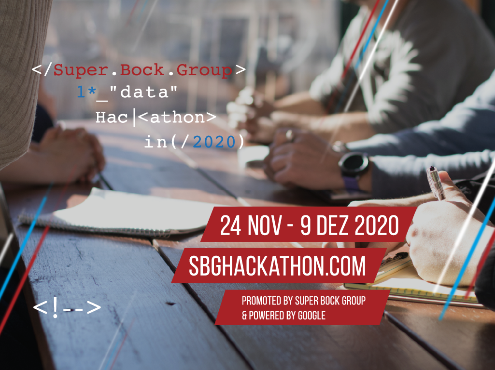

O LCD associa-se ao primeiro Data Hackthon promovido pelo Super Bock Group (SBG) a ter lugar - em formato virtual - de 24 Novembro a 9 Dezembro 2020. Para mais informações consulta o site do evento em [sbghackathon.com](https://sbghackathon.com/).

O Super Bock Group (SBG) promove o seu primeiro Data Hackathon. Esta 1ª edição será totalmente virtual, de 24 Novembro @ 9 Dezembro 2020.

Esta iniciativa visa promover o desenvolvimento de projetos e soluções inovadoras em contexto de competição, com desafios reais aplicados ao negócio do SBG, com possibilidade de integração num projeto com a equipa do Digital Hub do SBG, ganhar certificações, bolsas e prémios!

O evento é dirigido especialmente a start-ups ou entidades comerciais de pequena dimensão e estudantes universitários de áreas relacionadas com análise de dados ou semelhantes.

Os participantes terão acesso a datasets disponibilizados pelo SBG na plataforma cloud do parceiro tecnológico do evento, a Google, permitindo dessa forma a extração de padrões e insights, relevantes para os processos e negócio do SBG.

Com o apoio de mentores e com base em dados reais do negócio, esta competição de 20 equipas pré-selecionadas pretende fomentar a inovação e espírito empreendedor do ecossistema tecnológico e a comunidade académica.

Inscrições no site [www.sbghackathon.com](https://sbghackathon.com/).

Consulte o regulamento e todas as informações no site do evento ou contacte-nos pelo endereço: info@sbghackathon.com.
