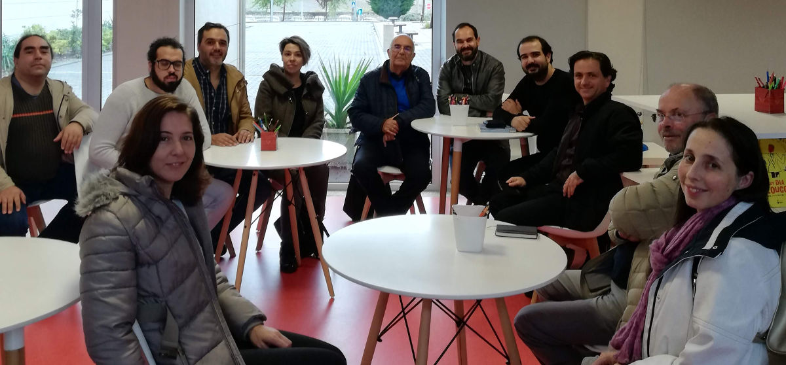

Visitamos esta sexta-feira a <a href="http://www.escoladaponte.pt/novo/" target="_BLANK">Escola da Ponte</a> para conhecer melhor os métodos que são seguidos.

Na Escola da Ponte não existem “turmas” nem “anos” os alunos definem em conjunto com o seu tutor o seu plano, para a quinzena.

A aprendizagem é feita em pequenos grupos que partilham os temas durante essa quinzena. Ao fim da quinzena os grupos dissolvem-se.

O que nos acabou por surpreender foi o ser tão estruturado, os alunos fazem os seus planos quinzenais e diários com aquilo que se propõem estudar, pesquisar, e aprender nesse intervalo.

Por outro lado como estes planos, ou contratos de compromisso, têm que ser definidos com os professores acaba por haver um acompanhamento muito mais personalizado a cada aluno.

Esta visita de estudo à Escola da Ponte integra-se na pesquisa que no LCD Porto estamos a fazer sobre o processo de aprendizagem e como poderemos melhorar os nossos processos de aquisição e transmissão de conhecimento.

Agradecemos à escola da Ponte a oportunidade de os visitar e esperamos voltar recorrentemente.

