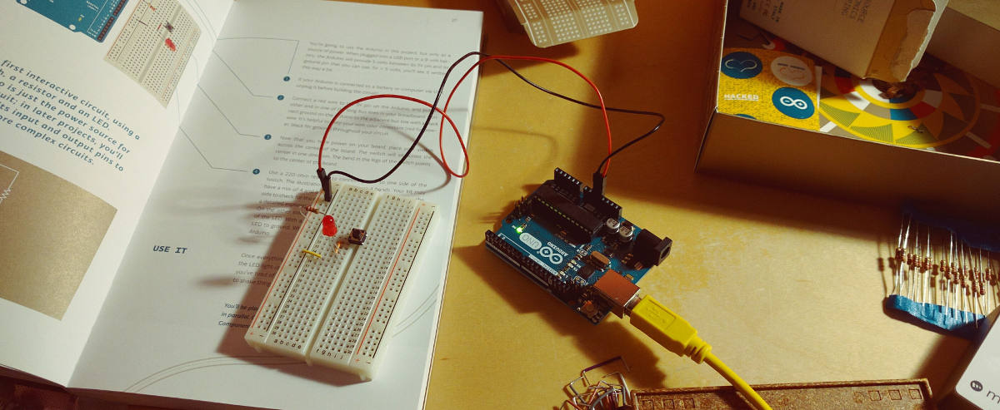
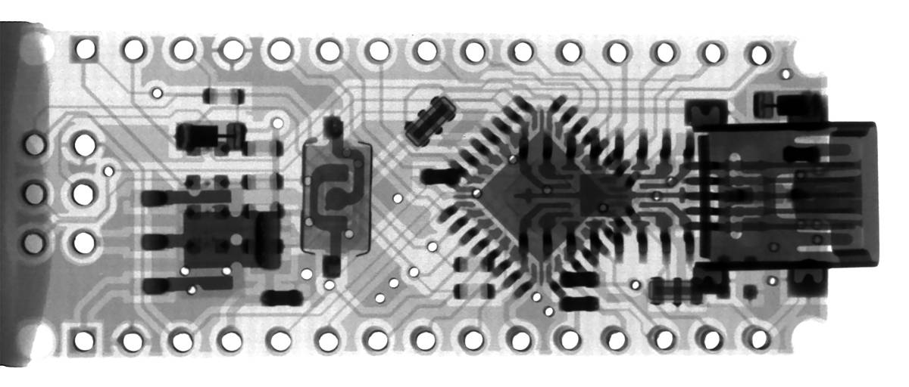

O Arduino é um projeto de microcontrolador de código aberto que literalmente muda o mundo.

Originalmente desenvolvido na Itália e batizado com o nome do bar que era frequentada por seus criadores, os clones Arduino e Arduino são agora fabricados por empresas em todo o mundo e estão disponíveis em várias configurações. Podes até mesmo construir seu próprio clone Arduino com facilidade usando componentes baratos que estão prontamente disponíveis.

A verdadeira beleza do Arduino está na sua simplicidade. Os programas Arduino (ou “Sketches”) são muito simples de escrever, por isso mesmo pessoas com pouca ou nenhuma experiência em programação podem compreender os conceitos e rapidamente escrever código úteil. O Arduino Hardware também é simples de usar e há uma grande quantidade de complementos (ou “Shields”) que podem se acoplar ao Arduino e expandir as suas capacidades. Apenas um conhecimento muito elementar de eletrónica é necessário para começar a construir todos os tipos de dispositivos usando o Arduino.

Este [workshop][ws] funciona como uma introdução ao Arduino, pretende ser uma porta de entrada para todos os que não têm conhecimentos prévios de eletrónica e/ou programação. O workshop será bastante prático e baseado na experimentação direta com o Arduino, desenvolvendo-se durante a atividade, pequenos projetos com vários sensores e atuadores.

Durante o workshop serão abordados os princípios básicos da eletrónica, programação, e os procedimentos para a prototipagem de ideias.

Só necessitas trazer o teu portatil, preferencialmente já com o [IDE do Arduino instalado](https://www.arduino.cc/en/Main/Software), no LCD Porto temos os Arduininos, sensores, atuadores e restante material de eletronica necessário.

#### Orientador: Nuno Barros

O Nuno Barros é Designer Multimédia, programador e director artístico. Aluno do Mestrado em Tecnologia e Arte Digital. Actualmente é CTO na agência de comunicação Bastarda.

<small>
Data: Sábado, 10-Nov-2018 
Duração: 7h 
Orientador: Nuno Barros 
Material necessário: Computador portátil

Inscrições: [Workshop de iniciação ao Arduino][ws]
</small>

---
<a href="https://unsplash.com/photos/lbqLxgvLt0U" target="_blank">Cover photo</a>
by <a href="https://unsplash.com/@spendude" target="_blank">Spencer _</a>

[ws]:https://lcdporto.org/atividades/workshop-introducao-ao-arduino
